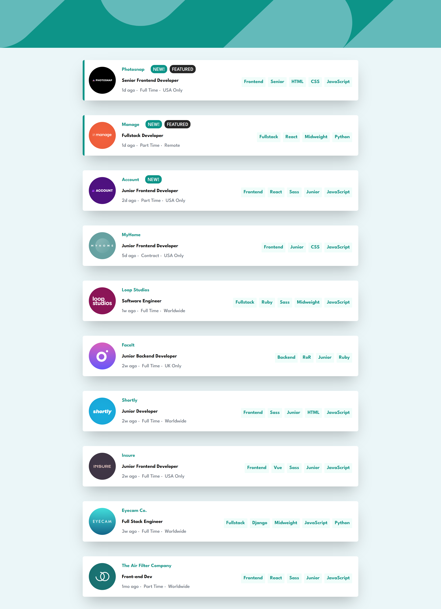

# Frontend Mentor - Job listings with filtering solution

This is a solution to the [Job listings with filtering challenge on Frontend Mentor](https://www.frontendmentor.io/challenges/job-listings-with-filtering-ivstIPCt). Frontend Mentor challenges help you improve your coding skills by building realistic projects. 

## Overview

### The challenge

Users should be able to:

- View the optimal layout for the site depending on their device's screen size
- See hover states for all interactive elements on the page
- Filter job listings based on the categories

### Screenshot

### Links

- Live Site URL: [Link](https://your-live-site-url.com)

## My process

### Built with

- Semantic HTML5 markup
- Mobile-first workflow
- [React](https://reactjs.org/) - JS library
- [Vite](https://https://vitejs.dev/) - Frontend Tool
- [Tailwind Css](https://tailwindcss.com/) - For styles

## Author

- Linked In - [Emi](https://www.linkedin.com/in/emiliano-acerbi-7a7141235/)

## Acknowledgments

Thanks to Frontend Mentor for the awesome challenge!
